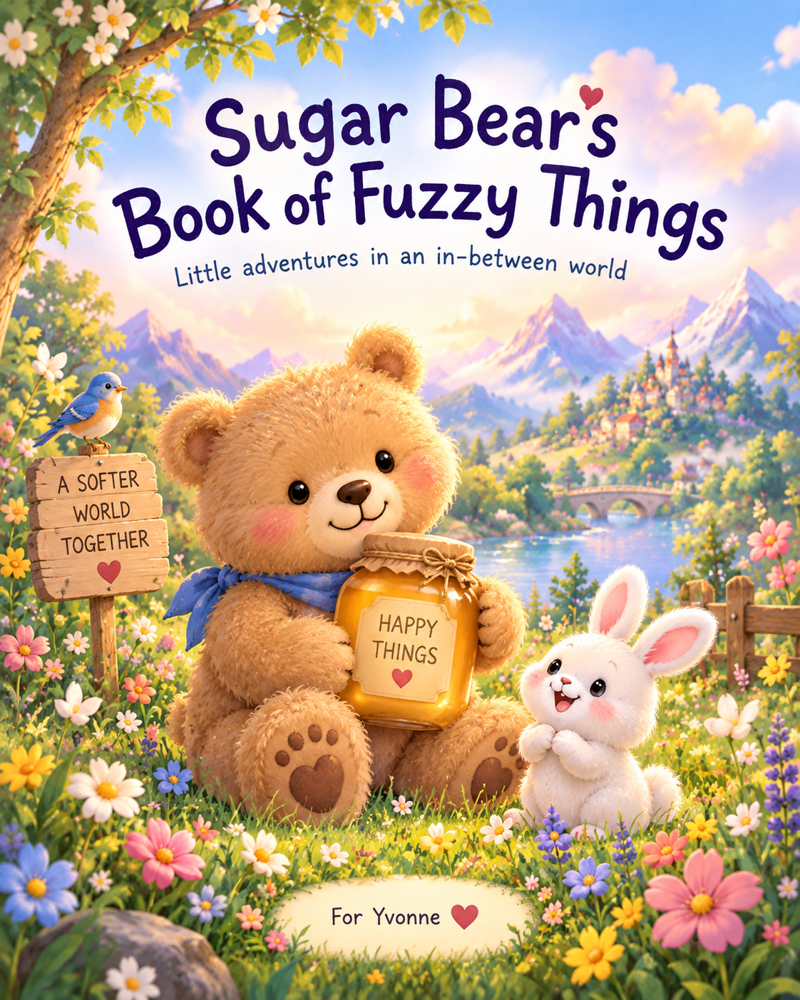
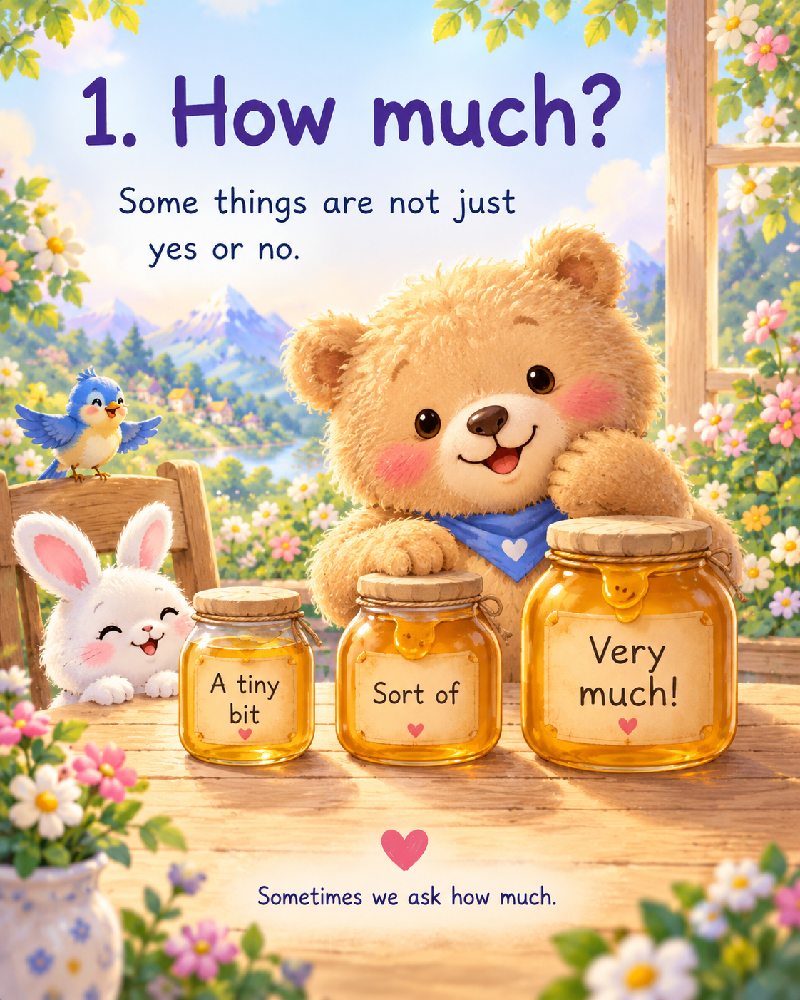
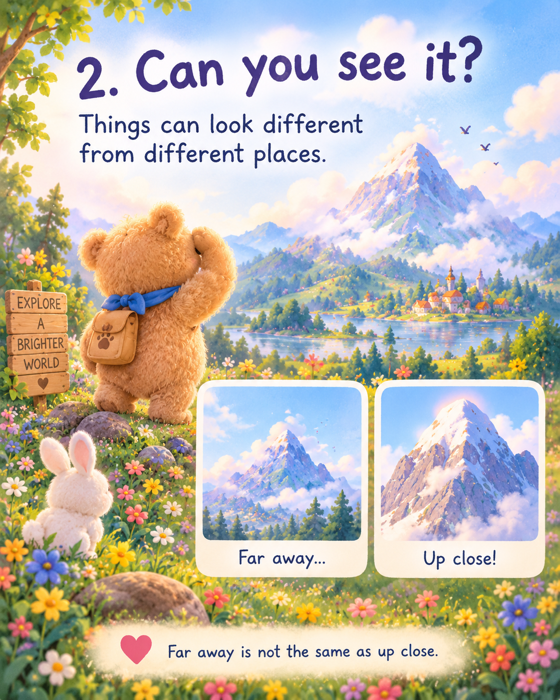
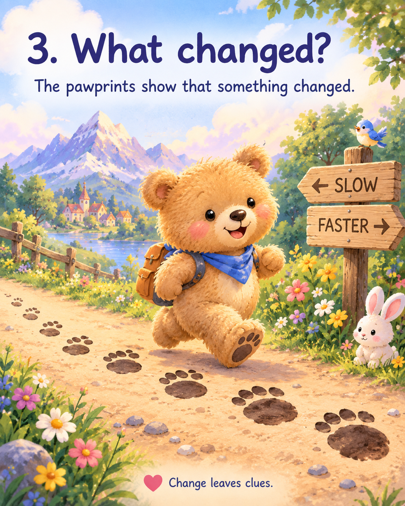
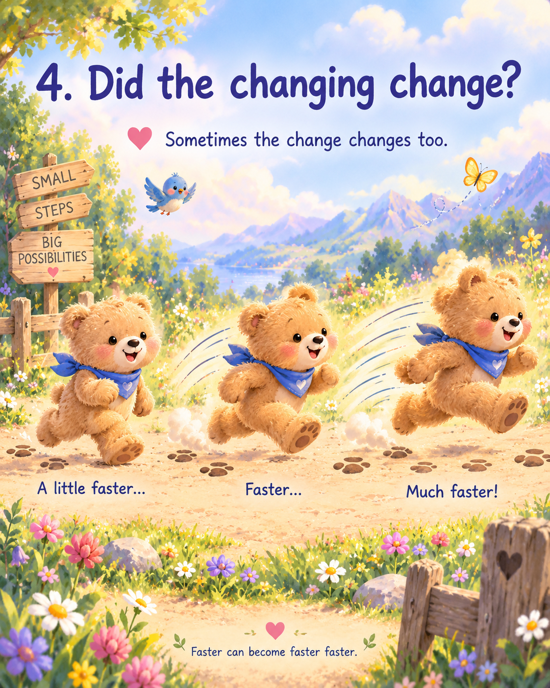
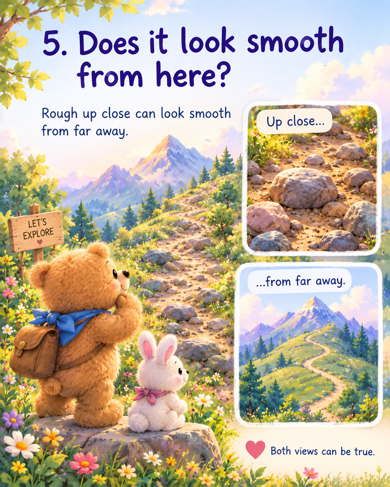
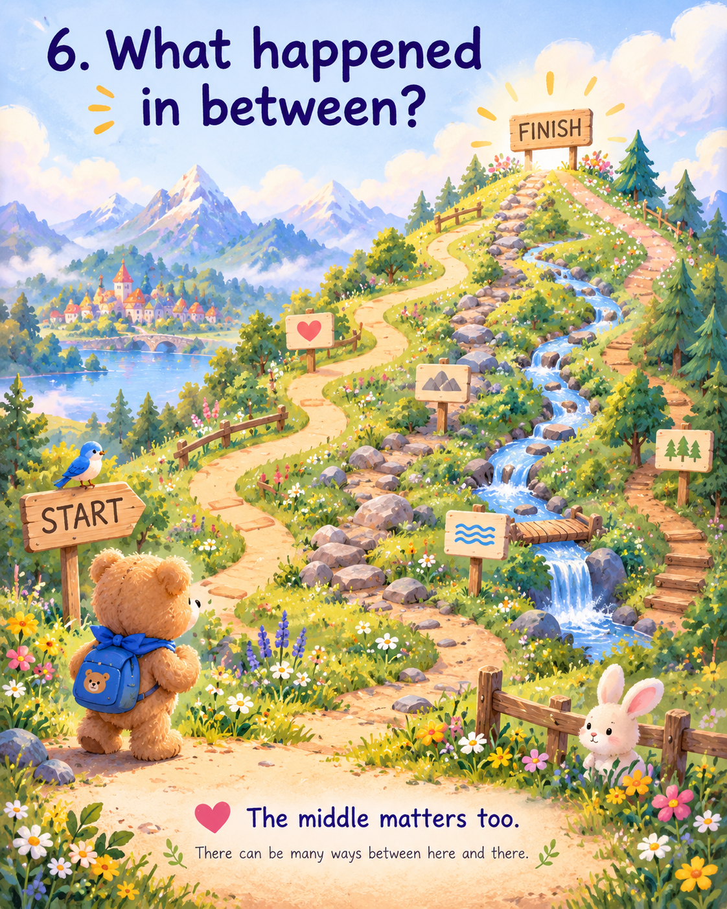
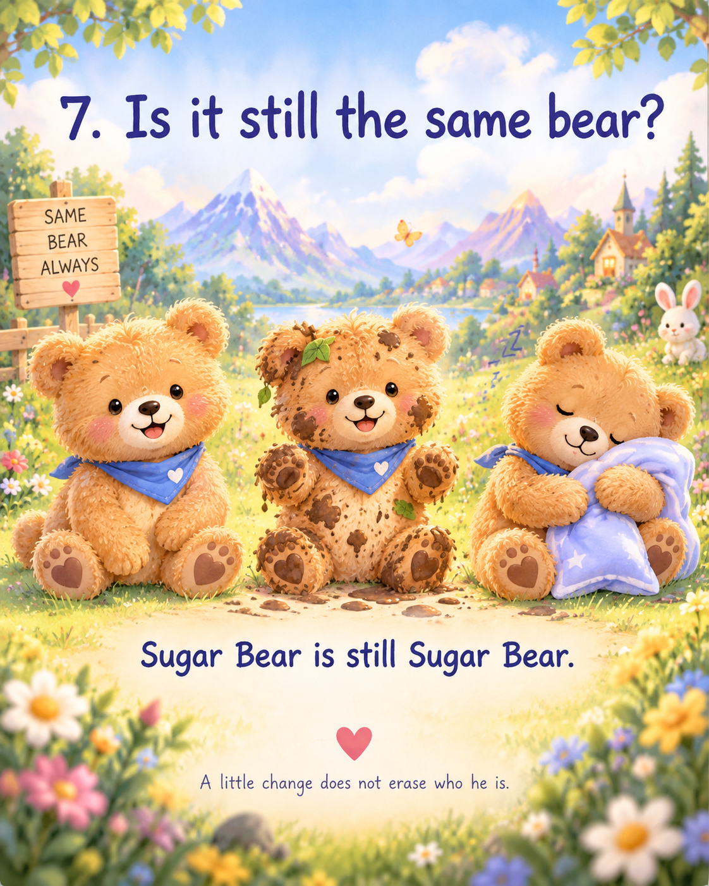
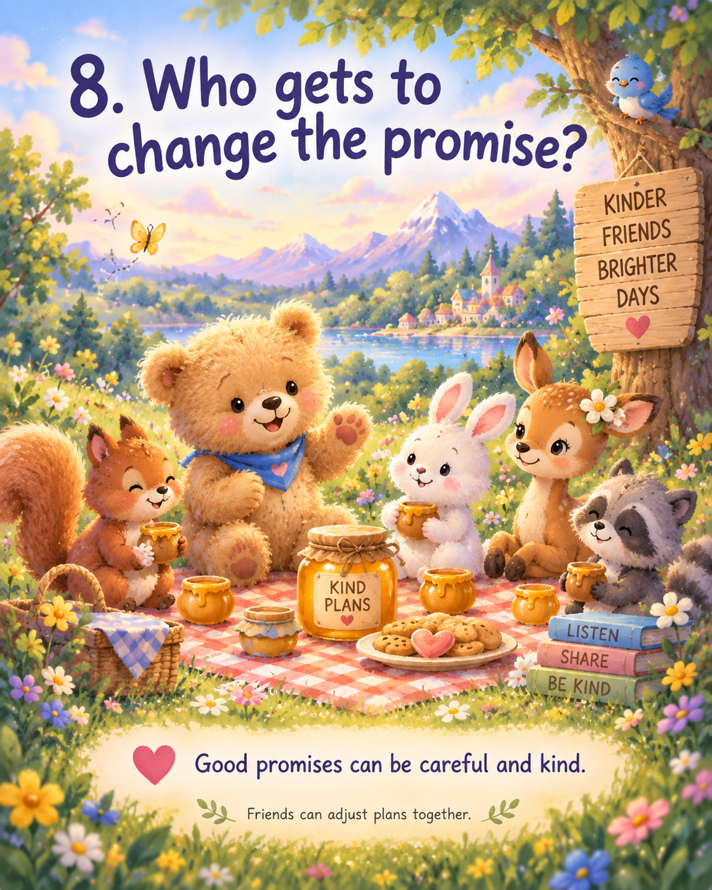
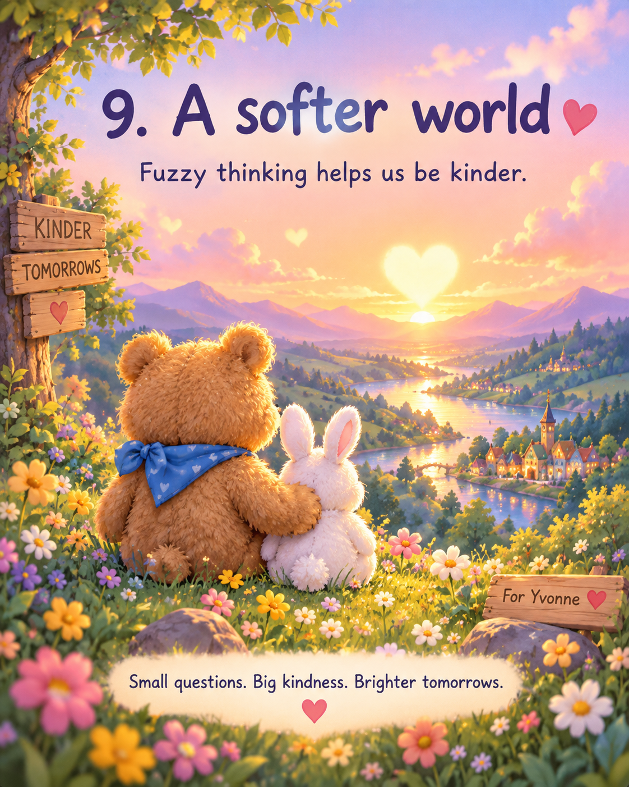

## 🐾 Try a tiny lesson

[Open a Picture Lesson](https://github.com/PaulTiffany/FuzzyCalculus/issues/new?template=picture-lesson.yml) · [Plant a Wonder](https://github.com/PaulTiffany/FuzzyCalculus/issues/new?template=wonder.yml)

Young children participate through a grown-up. Please never post a child's personal information.

---

*Sugar Bear's Book of Fuzzy Things* © 2026 **Paul Carver Tiffany III**. Licensed under [CC BY 4.0](https://creativecommons.org/licenses/by/4.0/).
