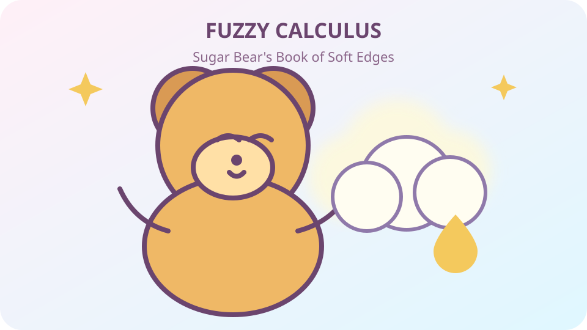

# Fuzzy Calculus

## Sugar Bear's Book of Soft Edges

Some things have sharp edges. A cookie cutter does.

Some things have soft edges. A cloud does. A shadow does. A friendship can, too.

**Fuzzy calculus is a way to talk about things that change when their edges are not perfectly sharp.**

This little book follows Sugar Bear and Yvonne through nine gentle lessons. It uses ordinary words, small numbers, and a great deal of honey.

No calculus class is required. If you can count to ten and notice that today can be a little different from yesterday, you are ready.

### Read the book

1. [The Edge That Would Not Sit Still](book/01-the-soft-edge.md)
2. [Two Bears, Two Honest Answers](book/02-two-honest-bears.md)
3. [The Sugar Scale](book/03-the-sugar-scale.md)
4. [Footprints of Change](book/04-footprints-of-change.md)
5. [When Change Changes](book/05-when-change-changes.md)
6. [Smooth Enough for Whom?](book/06-smooth-enough.md)
7. [The Boundary Keeps the Receipt](book/07-boundary-receipt.md)
8. [The Bear Who Forked in Two](book/08-the-forking-bear.md)
9. [The Honey-Picnic Promise](book/09-the-honey-picnic-promise.md)

Then visit the [tiny glossary](book/glossary.md).

### A promise to grown-ups

The stories are simple, but the ideas are not fake. They introduce:

- degrees instead of only yes or no;
- observer-relative distinction;
- resolution and symbolic smoothness;
- first and second differences;
- boundary accounting;
- identity and information loss across forks and merges.

The notation stays optional. Every symbol must first earn its meaning in a story.

### About

Created by **Paul Carver Tiffany III**.

Licensed under the [MIT License](LICENSE).

